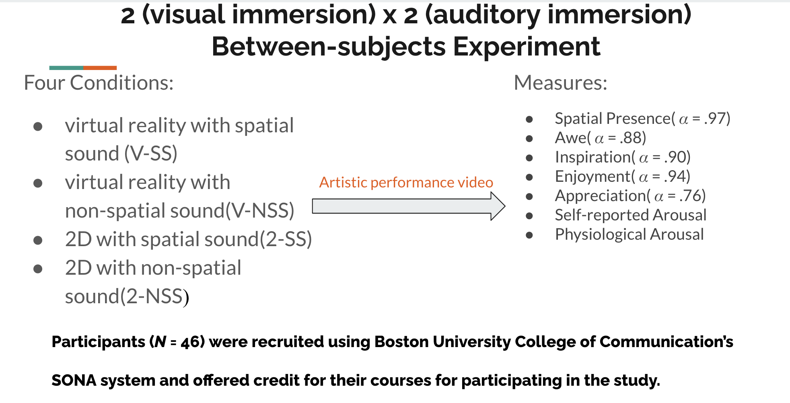

--- 
title: "A Scientific Way to Build a Likable Studying Music Playlist "
author: "Junqi Fu"
date: "`r Sys.Date()`"
site: bookdown::bookdown_site
documentclass: book
bibliography: [book.bib, packages.bib]
# url: your book url like https://bookdown.org/yihui/bookdown
# cover-image: path to the social sharing image like images/cover.jpg
description: |
  This is Junqi's final project in Professor Taylor C. Boas's PO841 class.
link-citations: yes
github-repo: rstudio/bookdown-demo
---

# Background

In 2021, Spotify disclosed in an official survey report that approximately 87% of participants in the U.S. and U.K. indicated that audio plays a significant role in enhancing productivity during various tasks, such as studying [@Spotify2021]. Between 2020 and 2021, Spotify noted a 26% rise in user-generated "focus" playlists on its platform worldwide. This increase underscores the growing functional role of music in the lives of users [@Spotify2021].


## Music \& Cognitive Perofrmance

Although there are differing opinions regarding the moderate effects of specific musical features and genres on enhancing cognitive tasks, cognitive scientists have found evidence that background music helps to increase workers' concentration and cognitive performance during work [e.g.,@Huang2011EffectsOB; @NationalUniversity2021]. According to @NationalUniversity2021, background music can activate both the left and right sides of the brain simultaneously, leading to maximized learning and improved memory. Additionally, music often indirectly influences cognitive performance through its significant impact on users' mood, blood pressure, and other physiological responses.

## Music \& Eudaimonia

Additionally, empirical research has explored the significant relationship between music and the experience of complicated emotional responses in users, such as self-transcendent emotions or eudaimonia. 

Self-transcendent emotions are a category of human emotions, including feelings like admiration, gratitude, hope, and inspiration. These emotions lead individuals to focus less on themselves and more on the needs of others [e.g., @felnhofer2013game;  @stellar2017self; @vancappellen2013positive]. Unlike other positive emotions, they possess a eudaimonic nature. By inducing a departure from our habitual cognitive patterns, self-transcendent emotions are capable of catalyzing our motivation towards both personal growth and the advancement of humanity's collective well-being [@algoe2009witnessing].

Cognitive scientists has found that significant relationship between long-term music engagement and development of self-transcendent/eudaimonia emotions. For example, 
@nijs2021flourishing explores how musical activities combined with movement practices (e.g., gospel music) can help young adults develop eudaimonic values such as self-awareness and a strong sense of belonging and bonding within their community. Furthermore, @verneert2021space's two-year study found that a sense of empathy, collective belonging, and meaningfulness develops in individuals when they continuously participate in collective improvisation with homeless adults and individuals facing emotional, psychological, and cognitive challenges.


## A Scientific Way to Build a Likable Studying Music Playlist For An Upcoming Cognitive Flow Study

However, most of previous studies on music and eudaimonia primarily focus on the psychological effects of musical performance and various modes of engagement with music, rather than directly exploring the psychological effects of musical audio features. Additionally, these studies investigating the relationship with engagement in music predominantly utilize longitudinal and ethnographic approaches.

In a larger experimental project, the author aims to use immersive technologies (e.g., virtual reality headsets) and biological measurements (e.g., galvanic skin response sensor) to understand the impact of various sensory immersion (e.g., visual and audio) on eliciting users' self-transcendent emotions, mediated by the condition of cognitive flow during exposure.



To explore how audio/musical features might interact with the psychological effects of audio immersion in this process, the author downloaded data on about 30,000 Spotify songs from Kaggle, a popular online data science platform. This data was originally collected and updated from Spotify using the R package "spotifyr" [@kaggle30000spotify]. This dataset includes both production information about the songs (e.g., artists, song names, popularity, and release dates) as well as various musical features measured by Spotify (e.g., genre, danceability, valence).

Utilizing this data, the author aims to identify the key musical features that influence users' choices of study music on Spotify and determine whether these features contribute to a song's popularity. Additionally, the study will examine how these musical features are affected or enhanced by other musical characteristics. By exploring these research questions, the author intends to use insights from this analysis to guide the design of an experimental plan.

Here's an overview of this dataset with a brief explanation of each musical feature:

- **Danceability**: a track's suitability for dancing, based on tempo, rhythm stability, beat strength, and regularity. It ranges from 0.0 (least danceable) to 1.0 (most danceable).
- **Energy**: a track's intensity and activity, on a scale of 0.0 to 1.0.
- **Loudness**: overall loudness of a track in decibels (dB), averaged across the entire track, typically range from -60 to 0 dB.
- **Speechiness**: detects spoken words presence in a track. Values closer to 1.0 indicate tracks composed mainly of speech. Values between 0.33 and 0.66 can include both music and speech, like rap music, while values below 0.33 are likely music or non-speech tracks.
- **Acousticness**: a measure from 0.0 to 1.0 indicating whether a track is acoustic. A value of 1.0 represents high confidence in the track being acoustic.
- **Instrumentalness**: predicts whether a track lacks vocals (ranging from 0.0 to 1.0). The closer the value is to 1.0, the more likely the track is purely instrumental.
- **Liveness**: detects the presence of an audience in the recording, ranging from 0.0 to 1.0. Higher values indicate a higher probability of the track being performed live. A value above 0.8 suggests the track is likely live.
- **Valence**: a measure from 0.0 to 1.0 that describes the musical positiveness conveyed by a track. High valence tracks sound positive (happy, cheerful), while low valence tracks sound negative (sad, angry).
- **Tempo**: overall estimated tempo of a track in beats per minute (BPM), relating to the speed of the song.
- **Duration**: length of the song, measured in milliseconds.

```{r, echo=FALSE,message=FALSE}
library(ggplot2)
library(webshot2)
library(lmtest)
library(sandwich)
library(webshot)
library(stargazer)
library(car)
library(plotly)
library(rio)
library(dplyr)
library(lubridate)
spotify<-import("spotify_songs.csv")
```

```{r}
summary(spotify)
```